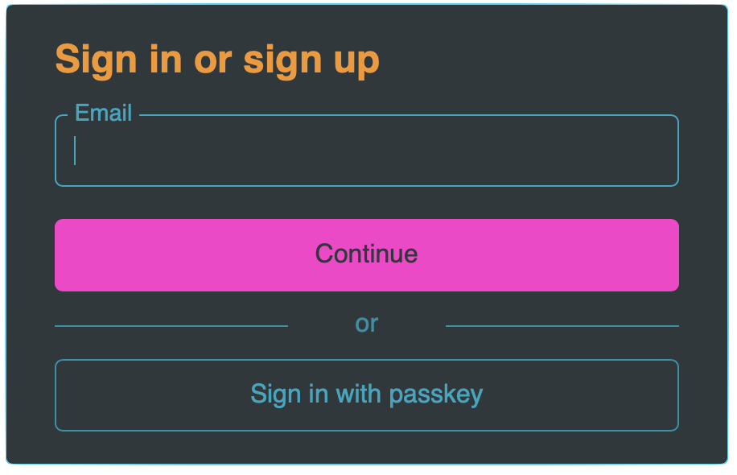

# &lt;hanko-auth&gt; element

The `<hanko-auth>` element offers a complete user interface that will bring a modern login and registration experience
to your users. It integrates the [Hanko API](../backend/README.md), a backend that provides the underlying
functionalities.

## Features

* Registration and login flows with and without passwords
* Passkey authentication
* Passcodes, a convenient way to recover passwords and verify email addresses
* Language support for English and German
* Customizable UI

## Upcoming Features

* Support for Security Keys
* Exponential backoff mechanisms
* Testing and code documentation

## Installation

_WiP_

## Usage

### Script

Import as a modules:

_WiP_

With a script tag via CDN:

_WiP_

### Markup

```html

<hanko-auth api="https://hanko.yourdomain.com" lang="en"/>
```

Please take a look at the [Hanko API](../backend/README.md) to see how to spin up the backend.

Note that we're working on Hanko Cloud, so that you don't need to run the Hanko API by yourself and all you need is to
do is adding the `<hanko-auth>` element to your page.

## Attributes

- `api` the location where the Hanko API is running.
- `lang` Currently supported values are "en" for English and "de" for German. If the value is omitted, "en" is used.

## Events

Events are dispatched on the `<hanko-auth>` element. These events do not bubble.

- `success` - Login or registration completed successfully and a JWT has been issued. You can now take control and
  redirect the user to protected pages.

```js
const hanko = document.querySelector('hanko-auth')

hanko.addEventListener('success', () => {
    hanko.parentElement.innerHTML = 'secured content...'
})
```

## Demo

The animation below demonstrates how user registration with passwords enabled looks like. You can set up the flow you
like using the [Hanko API](../backend/README.md) configuration file. The registration flow also includes email
verification via passcodes and the registration of a passkey so that the user can log in without passwords or passcodes.


## CSS Variables

CSS variables can be used to style the `hanko-auth` element to your needs. Without any variables set, the UI is styled
already (take a look at the animation above). From here you can start modifying `--default` variables which will
override the preset values. If you like to customize the user interface even more, or set the exact property values for
certain element types, take a look at the custom element variables.

### Default

Based on preset values and provided `--default` variables, individual elements will be styled, including color shading
for different UI states (e.g. hover, focus,..). You can combine them with the custom element variables below.

Note that `--default` colors must be provided as individual HSL values. We'll have to be patient, unfortunately, until
broader browser support for relative colors arrives, which would allow native CSS colors to be used.

```css
hanko-auth {
    --default-color-h
    --default-color-s
    --default-color-l

    --default-brand-color-h
    --default-brand-color-s
    --default-brand-color-l

    --default-background-color-h
    --default-background-color-s
    --default-background-color-l

    --default-error-color-h
    --default-error-color-s
    --default-error-color-l

    --default-border-radius
    --default-border-style
    --default-border-width

    --default-font
    --default-input-height
    --default-item-margin

    --default-lightness-adjust-dark
    --default-lightness-adjust-dark-light
    --default-lightness-adjust-light
    --default-lightness-adjust-light-dark
}
```

### Custom elements

Custom element variables override preset values and `--default` variables. They allow you to change CSS properties for
different elements, or resize the entire UI.

```css
hanko-auth {
    --container-background
    --container-border
    --container-border-radius
    --container-box-shadow
    --container-max-height
    --container-max-width
    --container-min-height
    --container-min-width
    --container-padding

    --divider-border
    --divider-color
    --divider-display
    --divider-font
    --divider-margin
    --divider-padding
    --divider-visibility

    --error-background
    --error-border
    --error-border-radius
    --error-color
    --error-font
    --error-margin
    --error-padding

    --footer-padding

    --headline-color
    --headline-display
    --headline-font
    --headline-margin

    --link-color
    --link-color-disable
    --link-color-hover
    --link-font
    --link-text-decoration
    --link-text-decoration-hover

    --paragraph-color
    --paragraph-font
    --paragraph-margin

    --passcode-input-space-between

    --primary-button-background
    --primary-button-background-disable
    --primary-button-background-focus
    --primary-button-background-hover
    --primary-button-border-width
    --primary-button-border-color
    --primary-button-border-color-disabled
    --primary-button-border-color-focus
    --primary-button-border-color-hover
    --primary-button-border-style
    --primary-button-border-style-disbled
    --primary-button-border-style-focus
    --primary-button-border-style-hover
    --primary-button-border-width
    --primary-button-border-width-disabled
    --primary-button-border-width-focus
    --primary-button-border-width-hover
    --primary-button-border-radius
    --primary-button-color
    --primary-button-color-disabled
    --primary-button-color-focus
    --primary-button-color-hover
    --primary-button-font
    --primary-button-height
    --primary-button-margin

    --secondary-button-background
    --secondary-button-background-disable
    --secondary-button-background-focus
    --secondary-button-background-hover
    --secondary-button-border-color
    --secondary-button-border-color-disabled
    --secondary-button-border-color-focus
    --secondary-button-border-color-hover
    --secondary-button-border-style
    --secondary-button-border-style-disbled
    --secondary-button-border-style-focus
    --secondary-button-border-style-hover
    --secondary-button-border-width
    --secondary-button-border-width-disabled
    --secondary-button-border-width-focus
    --secondary-button-border-width-hover
    --secondary-button-border-radius
    --secondary-button-color
    --secondary-button-color-disable
    --secondary-button-color-focus
    --secondary-button-color-hover
    --secondary-button-font
    --secondary-button-height
    --secondary-button-margin

    --text-input-background
    --text-input-background-disabled
    --text-input-background-focus
    --text-input-border-color
    --text-input-border-color-disabled
    --text-input-border-color-focus
    --text-input-border-style
    --text-input-border-style-disabled
    --text-input-border-style-focus
    --text-input-border-width
    --text-input-border-width-disabled
    --text-input-border-width-focus
    --text-input-border-radius
    --text-input-color
    --text-input-color-disabled
    --text-input-color-focus
    --text-input-font
    --text-input-height
    --text-input-margin
    --text-input-padding
}
```

### Example

```css
hanko-auth {
  --default-color-h: 188;
  --default-color-s: 99%;
  --default-color-l: 38%;

  --default-brand-color-h: 315;
  --default-brand-color-s: 100%;
  --default-brand-color-l: 59%;

  --default-background-color-h: 196;
  --default-background-color-s: 10%;
  --default-background-color-l: 21%;

  --default-border-width: 2px;

  --default-font: 400 16px Helvetica;

  --headline-font: 800 24px Helvetica;
  --headline-color: hsl(33, 93%, 55%);

  --primary-button-font: 800 15px Helvetica;

  --link-text-decoration-hover: underline;

  --container-min-height: 0;
  --container-padding: 10px 20px;
}
```

Result:




## Browser support

- Chrome
- Firefox
- Safari
- Microsoft Edge
