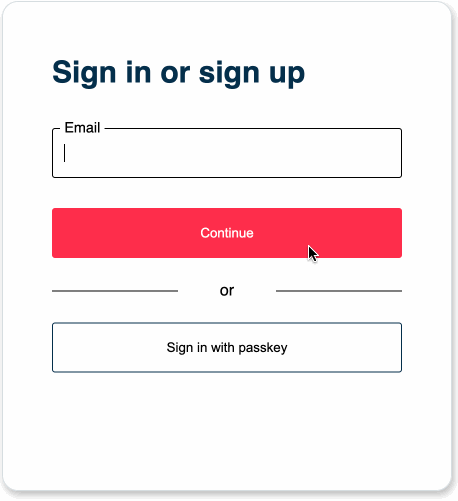

# &lt;hanko&gt; element

The `<hanko>` element offers a complete user interface that will bring a modern
login and registration experience to your users. It integrates the Hanko API,
a backend that provides the underlying functionalities.

## Features

* User registration and login flows with and without passwords
* Platform Authenticators (e.g. Apple's Passkeys, Windows Hello, etc.)
* Passcodes, a convenient way to recover passwords and verify email addresses
* Internationalization

## Upcoming Features

* Customizable UI styles
* Customizable translations
* Exponential backoff mechanisms
* Support for Security Keys

## Installation

_WiP_

## Usage

### Script

Import as a modules:

_WiP_

With a script tag via CDN:

_WiP_

### Markup

```html
<hanko api="https://hanko.yourdomain.com" lang="en" />
```

Please take a look at the [Hanko API](../backend/README.md) to see how to spin up the backend.

Note, that we're working on a SaaS solution, so that you don't need to run the
Hanko API by yourself and everything you need is to add the `<hanko>` element
to your page.

## Attributes

- `api` the location where the Hanko API is running.
- `lang` Currently supported values are "en" for English and "de" for German. If the value is omitted, "en" is used.

## Events

Events are dispatched on the `<hanko>` element. These events do not bubble.

- `success` - Login or registration completed successfully and a JWT has been issued. You can now take control and redirect the user to protected pages.

```js
const hanko = document.querySelector('hanko')
const container = hanko.parentElement

hanko.addEventListener('success', () => container.innerHTML("<h1>secured content...</h1>"))
```

## Demo

The GIF below demonstrates how a user registration with passwords enabled looks like. You can set up the flow you like using the Hanko API
configuration file. The registration flow also includes email verification via passcodes and the registration of a
platform authenticator so that the user can log in without passwords or passcodes on the current device.



## Browser support

- Chrome
- Firefox
- Safari
- Microsoft Edge
